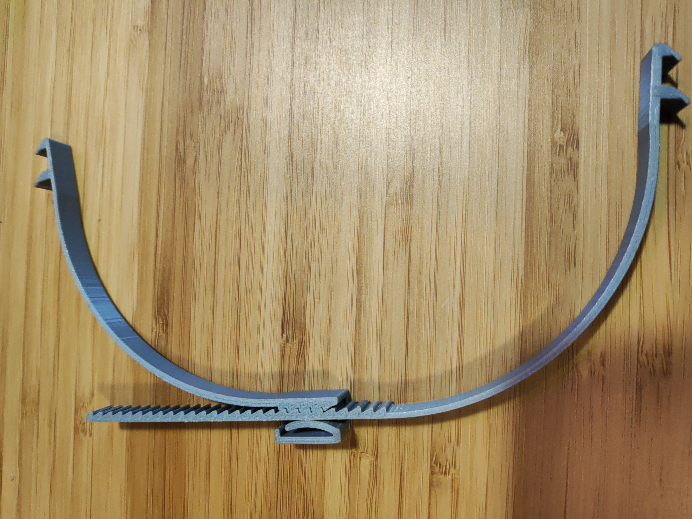

# Cinta trasera para viseras homologadas

Imprimir los 2 archivos para tener una cinta trasera con una cremallera funcional. Se puede utilizar con las viseras homologadas, sustituyendo la necesidad de conseguir una goma.

