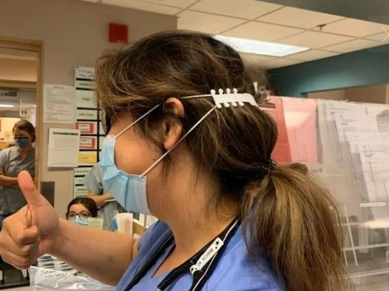
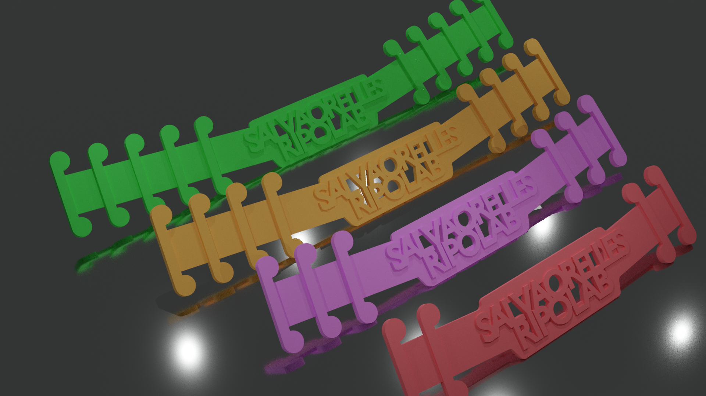

# Surgical Mask Strap Remix

**Accesorio** *Salva Orejas*

La idea de este accesorio es poder facilitar al personal médico el uso de mascarillas quirúrgicas durante mas tiempo si sufrir, ya que las gomas de fijación no irán en la parte trasera de las orejas, sino en sujetas con este accesorio.

### TAMAÑOS

- XS 2 eslabones: **Surgical_Mask_Strap_XS.stl**
- S 3 eslabones: **Surgical_Mask_Strap_S.stl**
- M 4 eslabones: **Surgical_Mask_Strap_M.stl**
- L 5 eslabones: **Surgical_Mask_Strap_L.stl**

### Originales:

Original: https://www.thingiverse.com/thing:4249113
Creador: Suraky

Original 2: https://www.thingiverse.com/thing:4286171
Original 3: https://www.thingiverse.com/thing:4273837

## Versiones Reto Ripolab Hacklab
- XS 2 eslabones: **Surgical_Mask_Strap_XS_RIPOLAB.stl**
- S 3 eslabones: **Surgical_Mask_Strap_S_RIPOLAB.stl**
- M 4 eslabones: **Surgical_Mask_Strap_M_RIPOLAB.stl**
- L 5 eslabones: **Surgical_Mask_Strap_L_RIPOLAB.stl**

